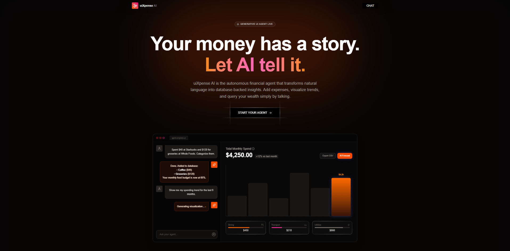

# uixpense-ai 🚀

A modern, AI-powered personal finance assistant that turns natural language into structured expense tracking and visual insights.



---

## ✨ Core Features

- **Natural Language Entry**: Just type "Spent 50 on dinner at XYZ restaurant" and let the AI parse, categorize, and log it instantly.
- **AI-Driven Querying**: Ask questions like "How much did I spend on groceries this month?" for immediate answers.
- **Dynamic Visual Insights**: Generate interactive charts on demand by simply asking for them.
- **LangGraph Orchestration**: Built using LangChain's LangGraph for complex reasoning and stateful AI interactions.
- **Type-Safe & Modern**: Powered by React 19, Tailwind CSS 4, and Node.js.

## 🛠️ Tech Stack

- **Frontend**: [React 19](https://react.dev/), [Vite](https://vitejs.dev/), [Tailwind CSS 4](https://tailwindcss.com/)
- **Backend**: [Node.js](https://nodejs.org/), [Express](https://expressjs.com/), [node:sqlite](https://nodejs.org/api/sqlite.html)
- **AI Engine**: [LangChain](https://www.langchain.com/), [LangGraph](https://langchain-ai.github.io/langgraph/), [Groq](https://groq.com/)

---

## 🚀 Quick Start

### 1. Prerequisites
- [pnpm](https://pnpm.io/) installed.
- A [Groq API Key](https://console.groq.com/).

### 2. Setup Server
```bash
cd server
cp .env.example .env.local # Add your GROQ_API_KEY
pnpm install
pnpm run dev
```

### 3. Setup Client
```bash
cd client
pnpm install
pnpm run dev
```

---

## 🔒 Security
Your financial data is stored locally in an SQLite database using Node's native SQLite support, ensuring privacy and speed.

---

Developed by [Mukul Padwal](https://mukulpadwal.me)
